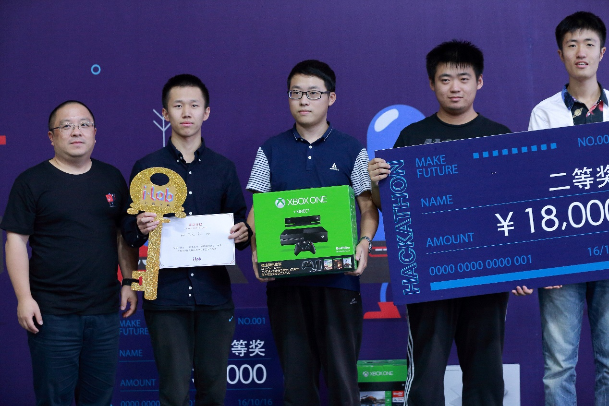
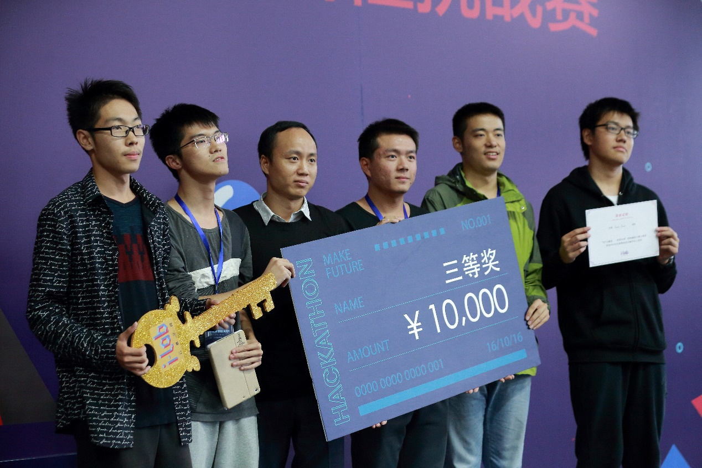
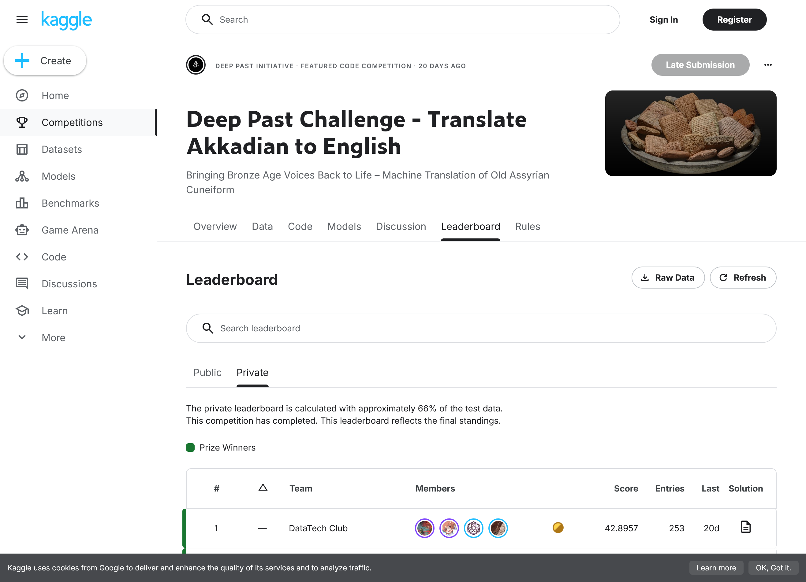
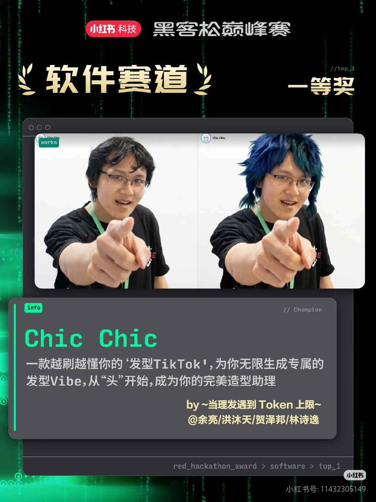
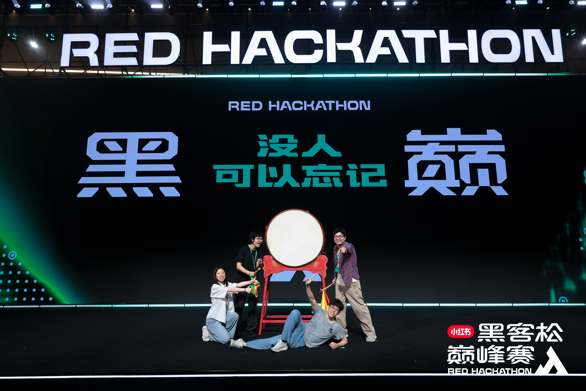

## 48 小时能做什么？

2026 年 4 月 10 日，由小红书举办的 **“2026 小红书黑客松巅峰赛”** 圆满落幕。由信息学院两大科技社团的领军人物—— GeekPie 前任社长 **贺泽邦** 和 DataTech（原 GeekPie 数据科学方向）社长 **洪沐天** 及他们的团队“当理发遇上 Token 上限”开发的 ChicChic 夺得软件赛道一等大奖，并囊获 50000 元奖金。这也是 GeekPie 再一次在全国性黑客松拿下头筹奖金。

本次黑客松巅峰赛是小红书科技薯主办的第一次黑客松，此届更是有超过 62% 的 00 后选手同台竞争。来自五湖四海的开发者齐聚一堂，在 48 小时的严格限制下，不许提前制作，从零开发一个完整的 MVP 并由各大评委打分。其中软硬件赛道的前五可以前往决赛进行最终的路演并角逐巨额奖金。

## 什么是黑客松？

“黑客松”这个词，源于英文 Hackathon，是黑客 Hacker 和马拉松 Marathon 的结合。它不仅是程序员写代码，更是世界上最酷、最硬核的脑力极限运动。

黑客松的基本模式，是由几百名顶尖极客，在一个巨大的封闭空间里，在连续的 24 小时、48 小时等时间限制内，从0到1，把一个天马行空的想法，变成一个能跑能用的产品Demo。除了热衷钻研技术的软件工程师，参与黑客马拉松的还有来自各种风投公司、初创公司和互联网大厂的团队。最早的黑客马拉松距今已有超过 20 年历史，如今，这一活动已经从极客圈的小众活动逐渐变成了一种广泛的创新的文化象征，是人类创新智斗的巅峰对决。

## GeekPie/DataTech 与黑客松

作为上海科技大学最大的科技社团，[GeekPie](https://geekpie.club) 早就与黑客松深深的绑定在了一起。早在 2016 年，GeekPie 社团创始人吕文涛等本科生就曾代表上科大在黑客松取得佳绩。黑客松动辄数万元的奖金，成为了 GeekPie 一代又一代成员赚取“零花钱”的生活回忆。

[DataTech 社团](https://www.datatech.club) 由前 GeekPie 数据科学方向孵化而来，由 GeekPie 社员、22 届本科生洪沐天创立。早在 GeekPie 时期，团队就获得 ADIA Lab 因果发现挑战赛第三名。至今短短几年的创立时间却也已包揽各大奖项，游走于 kaggle 等知名数据科学竞赛中。

社团的发展也与学院的支持密不可分，依托上海科技大学信息学院，GeekPie / DataTech 社团拥有充足的算力资源可供自由调度，社团成员申请即可使用，这也大大增强了社团在各大科学研究、超算比赛和数据科学竞赛上的积极性与活跃度。本次小红书竞赛中，社团也充分利用了学校的高性能 GPU 资源，在此之上搭建了 ChicChic 的发丝建模到发型迁移的整套工作流，为创新能力的施展提供了充分的平台和资源保障。

## ChicChic，做用户和 Tony 老师之间的 Google Translate

“理发就是 VibeCoding，和 Tony 老师永远要解释半天，就像抽卡一样……”

这一次，两位社长创造性地将理发的痛点发掘，并结合了二位各自领域擅长的技能点，在团队中成为了不可或缺的中坚力量。

GeekPie 前社长贺泽邦，同时也是 GeekPie_HPC 超算队队长、GeekPie_404 前后端团队首席负责人，创造性地将前后端开发经验与超算的集群维护及调度经验结合，负责了本次应用开发的后端开发、Workflow 搭建、集群管理，并实现了 ComfyUI 的多卡调度和并行算法。

DataTech 社长洪沐天，则发挥数据科学的专长，在数小时内复现了信息学院虞晶怡导师组的 GaussianHaircut 的部分功能的同时，训练了专属于发型的识别和机器学习推荐系统。在本次应用开发中扛起了算法工程师的大旗。

创新永不过期，真爱不会变质。未来 GeekPie 与 DataTech 将继续带领社团角逐各类黑客松，驰骋更多的赛场，留下上海科技大学的辉煌旗帜！

