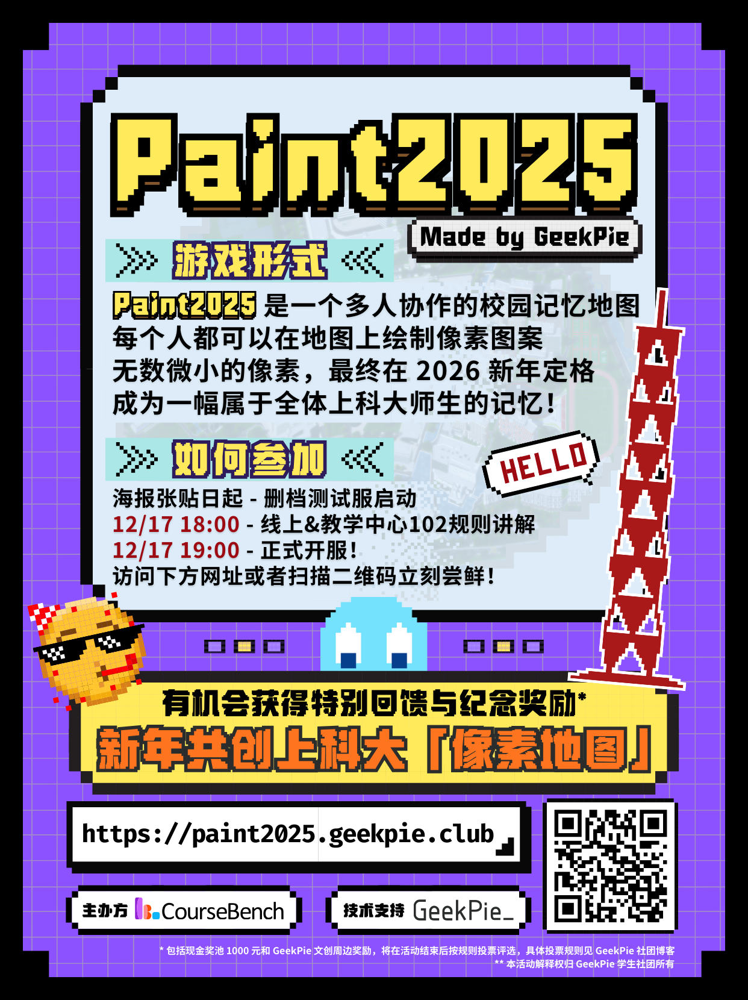

# Paint2025 新年绘板

> 2025 要被定格成什么样子？

去年我们有过许多瞬间：比赛、展演、寝室的深夜讨论、图书馆的清晨打卡……今年我们把这些瞬间用像素画下来。

Paint2025 是一个多人在线协作的画布（灵感来自 r/place）——在一张覆盖整个上科大的像素地图上，你可以与所有师生同时创作、覆盖、合作或对抗。画社团徽标、画你和朋友的“地盘”、画表情包；每个像素都在记录属于我们的 2025。

📍活动时间：2025/12/22 12:00 开始，2026/1/1 00:00 定格画布。
🔗 参与入口：https://paint2025.geekpie.club
👑 奖励亮点：
- **灵魂画手奖**（赛后评比）—— **第1名 200 RMB / 第2名 150 RMB / 第3名 100 RMB**
- **广而告之奖** —— 转发空间即可获周边贴纸；再从中随机抽取 2 名各 **50 RMB**
- **天选之子奖** —— 从注册用户随机抽取 2 名，各 **50 RMB**
🔧 玩法要点：
- 每位玩家拥有 24 点体力，体力随时间冷却回复，冷却会逐渐加长；
- 可选择快速发育占领大块区域，或与同伴协作/对抗进行像素博弈；
- 开发者/高级玩家可以编写自动化脚本（注意遵守活动规则）。
📂 项目仓库：`HeZeBang/DrawingPlace`（欢迎感兴趣的同学贡献想法/提 PR）

来吧，把你的像素留在校园的地图上，让我们在新年一起回顾这张属于上科大的 2025。

