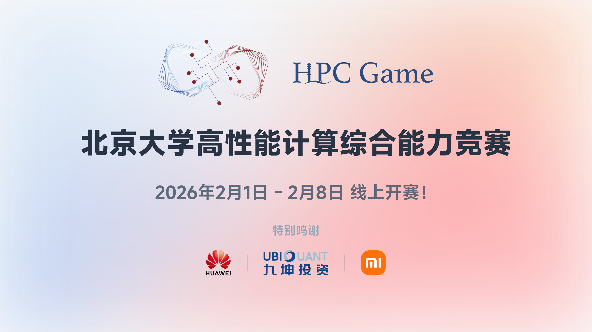

大家好，一年一度的由北京大学主办，GeekPie 等多所高校和社团参与协办的第三届 HPCGame 将于近日开赛！比赛设置了丰厚的奖励，欢迎大家对超算感兴趣的同学前来参赛，比赛成绩将作为之后超算队招新的参考！

## 比赛详情

- **比赛时间**：2026年2月1日11:00至2月8日23:59
- **比赛网址**：https://hpcgame.pku.edu.cn
- **比赛类型**：个人赛
- **主办方**：北京大学学生 Linux 俱乐部
- 本次比赛设有附加赛，时间为 2 月 10 日 12:00 至 3 月 3 日 23:59，部分挑战性较大、无法完整放入正式比赛的赛题会拆分成简单部分放入正式赛、较难部分作为附加赛赛题。附加赛可两人组队，欢迎同学们挑战。
- 请加入选手交流QQ群：679550783。

- - -

> 以下为主页搬运，仅供参考，一切以 https://hpcgame.pku.edu.cn/ 为准

## 比赛介绍

北京大学高性能计算综合能力竞赛（PKU HPCGame）是以高性能和并行计算为主题的入门向竞赛，目的是推进高性能计算在高校中的普及，提升同学们的计算素养。

比赛面向全国高校在校同学开放，追求零基础入门、题目难度具有梯度，致力于让完全没接触过高性能计算的新生和具备一定专业基础的同学都能享受比赛，在学习的过程中有所收获。

比赛是个人赛，我们针对高性能计算中的各个方向准备了相应的学习资料。经过学习和比赛，同学们可以对高性能和并行计算形成基本的认识，并掌握一定的实操能力。

我们对优胜者给予丰厚的激励，并颁发由北京大学计算中心和北大信息科学技术学院、北大计算机学院、北京大学长沙计算与数字经济研究院签发的获奖证书。我们欢迎北京大学的同学参加未名超算队，共同探索高性能计算的魅力。

题目考察的内容涉及到高性能计算的各个方面，包括萌新能愉快探索的入门题目和具有一定选拔作用的题目，有以下几个模块

-   高性能计算简介：导论部分，对高性能计算模块做基本介绍
-   并行与大规模：并行计算相关工具和 CPU 上的计算优化，还包括了多台机器间的交互
-   机器学习系统：NPU 与 GPU 等加速器并行计算，主要介绍加速器在高性能计算以及大模型训练推理优化方面的应用
-   综合应用提升：综合运用高性能计算各方面的知识，解决一些有趣的问题

比赛平台基于MIT协议开源，将会在赛后进行整理。

比赛的算力环境由[北京大学高性能计算平台](https://hpc.pku.edu.cn)与北京大学卓越中心项目支持。

## 赛程安排

|比赛环节|时间|说明|
|---|---|---|
|赛前讲座|2026 年 1 月 23 日 至 1 月 30 日|请关注QQ群通知与`live.lcpu.dev`网页通知|
|正式比赛|2026 年 2 月 1 日 11:00 至 2 月 8 日 23:59|个人赛|
|附加赛|2026 年 2 月 10 日 12:00 至 3 月 3 日 23:59|可最多两人组队，完成个人赛中对应的资质赛题即可参与，可能无奖励|
|颁奖典礼|另行通知|2026 年春季学期开学后于北京大学线下举行|

## 奖项设置

## 北京大学校内奖项设置

-   一等奖 5 名： 奖金 6000 元、获奖证书
-   二等奖 10 名： 奖金 4000 元、获奖证书
-   三等奖 15 名： 奖金 2000 元、获奖证书
-   优胜奖 20 名： 获奖证书、奖品
-   新生特别奖 3 名： 获奖证书、奖品《并行计算与高性能计算》

只有在校本科生和研究生参与评奖，请确保通过IAAA登录。一、二、三等奖及优胜奖颁发给校内排名 1 ～ 5、6 ～ 15、16 ～ 30、31 ～ 50 的选手。新生特别奖颁发给分数不低于优胜奖分数线且在新生中排名前 3 的选手。

## 校外选手奖励

-   一等奖 5 名：奖金 2000 元、获奖证书
-   二等奖 10 名：奖金 1500 元、获奖证书
-   三等奖 15 名：奖金 1000 元、获奖证书

协办组织所在高校获奖选手将获奖500元额外奖金。获奖选手需通过学信网验证在校身份，且需不低于北京大学对应奖项分数线。

## 特别赛道奖

-   解题特别奖（若干）：奖金、纪念品，奖励超出组委会预期的优秀解法

## 相关单位

### 主办单位

北京大学计算中心

### 联合主办

北京大学计算机学院

北京大学信息科学技术学院

北京大学长沙计算与数字经济研究院

### 承办单位

北京大学未名超算队

北京大学学生 Linux 俱乐部

### 协办组织

（按确定协办的先后顺序排列、目前还在招募中）

-   上科大GeekPie_HPC
-   东南大学 Linux 俱乐部
-   齐鲁工业大学网络运维
-   北京航空航天大学超算社
-   华中科技大学七边形超算队
-   兰州大学开源社区
-   电子科技大学 Negation 超算俱乐部
-   中国科学技术大学学生 Linux 用户协会
-   澳门科技大学超算队
-   西安电子科技大学开源社区
-   南京大学 e-Science 中心
-   北京联合大学计算机技术社
-   浙江大学超算队
-   北京理工大学 Linux 用户小组
-   上海交通大学 Xflops 超算队
-   上海大学开源社区

### 特别鸣谢

  
  
  
  
